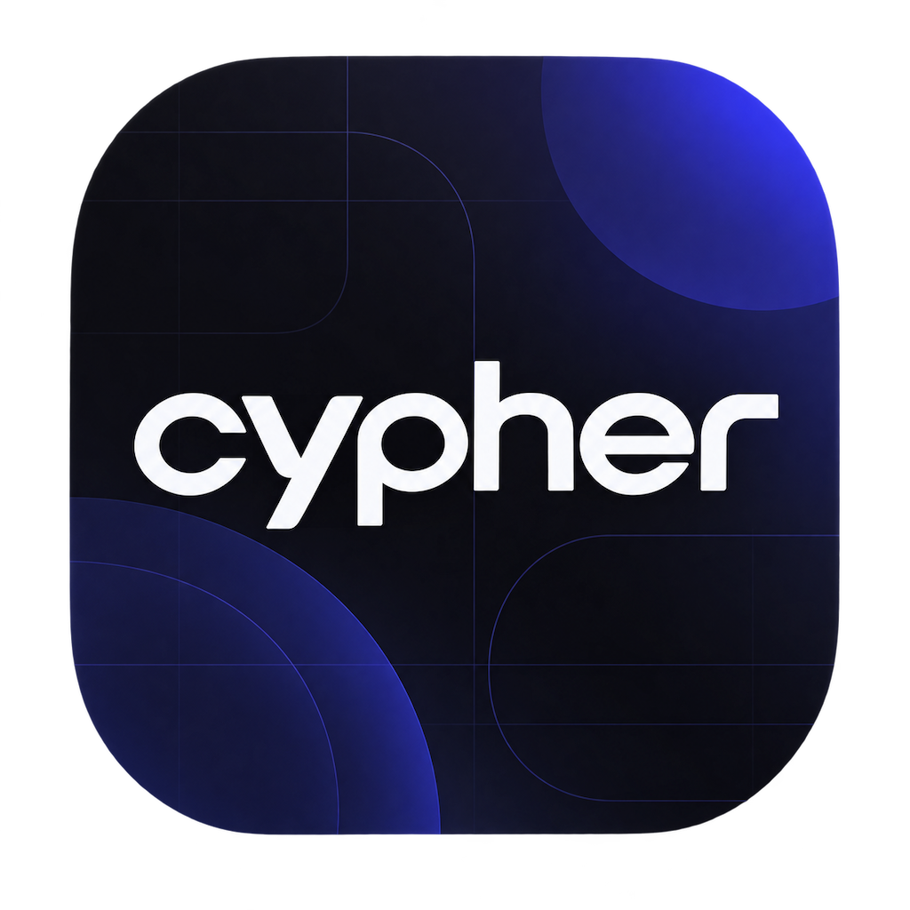
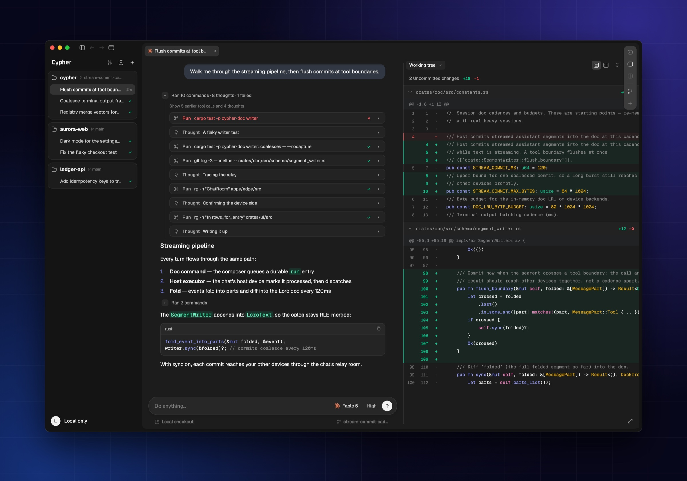

<p align="center">
  
</p>

<h1 align="center">Cypher</h1>

<p align="center">
  Control coding agents from any device. Execution stays on your machines.
</p>

<p align="center">
  <a href="https://letscypher.app">Website</a> ·
  <a href="#install">Install</a> ·
  <a href="docs/README.md">Documentation</a>
</p>

<p align="center">
  
</p>

Cypher runs the [Pi](https://github.com/earendil-works/pi) coding agent on your own
machines and lets you drive it from any of them. Every Mac or Linux server runs a small
engine that hosts its agents, terminals and repositories; the desktop app and the iPhone
app connect to those engines. Sessions stay on the device that runs them unless you turn
on sync.

## Features

- **Pi, built in.** A pinned Pi runtime with curated plugins, isolated from any Pi you
  installed yourself. Pick a model and thinking level, steer a run while it works, use
  slash commands, run subagents as child chats, and add MCP servers.
- **A workspace for many sessions.** Sessions open as tabs you can split, drag and zoom.
  Each has its own Git diff (unified or side by side), file browser, side chats and
  terminal.
- **Local first.** Without an account, everything stays on the device. Signing in never
  uploads your existing local sessions.
- **Every device.** Start an agent on a VPS, then follow or steer it from your laptop or
  phone; it keeps working after you close the lid.
- **One-click fleet updates.** Settings → Devices updates every online device, and Linux
  services update themselves when idle.
- **Yours to tune.** Themes, chat fonts, colors and spacing, and per-pane color overrides.

## Install

### macOS

Download the app from [letscypher.app](https://letscypher.app) (Apple Silicon). On first
launch it offers to download the Pi runtime. Then connect a model in Settings →
Providers: a ChatGPT subscription, Claude through an installed Claude Code CLI, or any
OpenAI-compatible gateway with an API key.

### Linux (headless)

```bash
curl -fsSL https://edge.letscypher.app/install.sh | sh
```

The setup wizard installs the Pi runtime, starts a systemd user service and, if you
want, connects the device to your account. Supported: x86_64 and aarch64 with glibc 2.31
or newer. This is a headless engine that you drive from the desktop or iPhone app; it has
no terminal chat UI.

```bash
cypher             # setup on first use, status afterwards
cypher setup       # continue or repair setup
cypher status      # device status (--verbose adds account, data and IPC details)
cypher logs        # recent engine logs (--follow streams them)
cypher update      # newest release and Pi runtime, then restart the service
```

Non-interactive installs, SSH, data directories and repair:
[Linux setup](docs/features/linux-setup.md).

### iPhone

The iPhone app is a remote control for your Macs and Linux devices: it browses your
projects, reads and continues sessions, and shows each session's files and changes. It
runs no agent and needs no provider credentials. It is distributed through TestFlight
and needs a synced account.

## Sync across devices

Sync is optional. On the desktop, open the account menu at the bottom of the sidebar and
choose **Enable sync**; on Linux, run `cypher setup`. Sign-in happens in the browser and
takes effect after a restart.

With sync on, chats and the workspace index sync through Cypher's Cloudflare edge.
Agents, terminals and repositories stay on the machines that run them; other devices
reach a session's files and diffs through the edge's device relay. Signing in does not
upload, move or import local sessions; they stay in the local profile and come back when
you sign out:

```bash
cypher daemon stop && cypher logout && cypher daemon start
```

## Build from source

The pinned Rust toolchain installs itself through `rustup` (`rust-toolchain.toml`).
Releases ship the desktop app for macOS and the headless engine for Linux.

```bash
cargo run -p cypher                                     # desktop app, engine in-process
cargo build --release -p cypher --no-default-features   # headless engine (Linux)
scripts/dev-demo.sh                                     # offline demo with seeded chats
bash scripts/check.sh all                               # the checks CI runs
```

[Development](docs/development/README.md) covers the repository layout, conventions and
the development app; [Architecture](docs/architecture.md) explains how the engine, apps
and edge fit together.

## Documentation

- [Docs index](docs/README.md)
- [Chat appearance](docs/features/chat-appearance.md),
  [appearance colors](docs/features/appearance-colors.md) and
  [Git diff layouts](docs/features/git-diff.md)
- [MCP settings](docs/features/mcp-settings.md)
- [CI and releases](docs/operations/ci-cd.md)

## License

[MIT](LICENSE). Bundled third-party components are listed in
[THIRD_PARTY_NOTICES.md](THIRD_PARTY_NOTICES.md).
