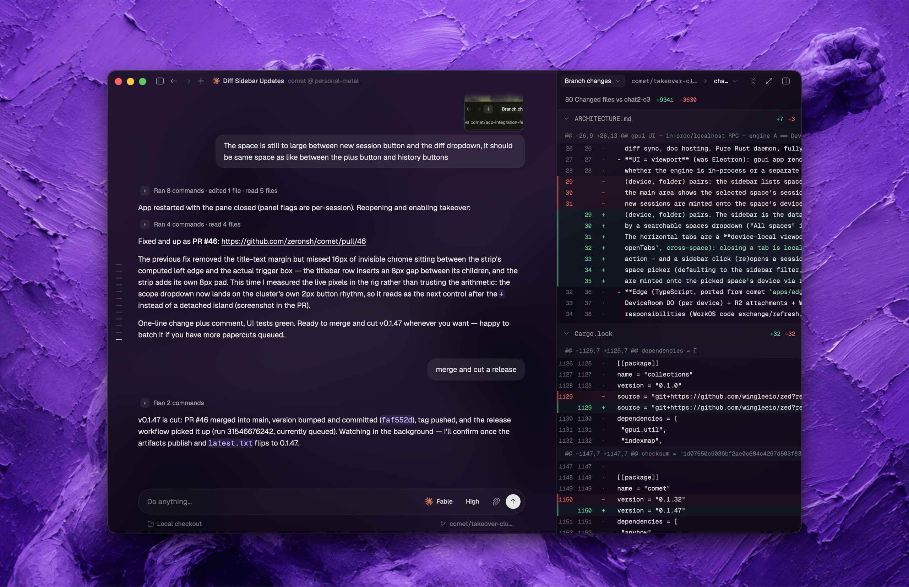

# Cypher

Control your coding agents (Claude Code, Codex, Cursor, Grok, Hermes, Pi) locally by default, with optional multi-device sync.



Every device runs a small engine that stores sessions on that device. The engine
remains local-only unless you explicitly connect an account.

## Set up a Linux device

```bash
curl -fsSL https://edge.letscypher.app/install.sh | sh
```

The installer opens one setup wizard: connect your account, install Pi Runtime,
start a **systemd user service**, and verify the device connection. Choose
local-only mode to skip account connection. Official Linux binaries support
glibc-based x86_64 and aarch64 systems with glibc 2.31 or newer. This is a
headless engine, not a terminal chat UI or Linux desktop application.

Day-to-day:

```bash
cypher             # setup on first use; concise status afterwards
cypher setup       # continue or repair setup
cypher status      # concise device status
cypher logs        # recent engine logs; --follow streams them
cypher update      # newest release + Pi Runtime; restarts the service
```

Linux services apply releases **automatically** in an idle window. SSH and
non-interactive installs, updates, Pi configuration, data directories and
installation integrity: [Linux setup](docs/linux-setup.md).

Any desktop can also update the whole fleet: Settings → Devices checks every
online device for a newer release and offers **Update** per device or **Update
all**. Each device applies its own release and restarts itself (a Linux service
restarts; a Mac swaps its app bundle and relaunches). A device with active runs
or open terminals refuses until idle, or until you choose **Update anyway**.
iOS updates through TestFlight and is not part of this.

## Optional multi-device sync

On Linux, run the setup wizard when you want to connect to desktop. It handles
safe service coordination around sign-in:

```bash
cypher setup
```

You can then start an agent on one synced device and follow or drive it from another. An always-on machine such as a VPS can keep those agents working after you close your laptop.

Signing in does not upload, move, or import existing local sessions. Local sessions and their attachments remain under the local profile and reappear when you return to local-only mode:

```bash
cypher daemon stop
cypher logout
cypher daemon start
```

`cypher login` and `cypher logout` refuse to modify credentials while an engine owns the data directory. The desktop app follows the same next-restart profile boundary.

On macOS: use the desktop release, or build `cypher` from source and run `cypher daemon install` to install the launchd service.

---

Developing or curious how it works? See [ARCHITECTURE.md](ARCHITECTURE.md).

CI, deployment prerequisites and release recovery: [CI/CD operations](docs/ci-cd.md).

Chat fonts, colors, spacing and wide-screen mode: [Chat appearance](docs/chat-appearance.md).

Overall themes and Terminal, Git and Sidebar color overrides: [Appearance colors](docs/appearance-colors.md).

Unified and side-by-side Git comparison: [Git diff layouts](docs/git-diff.md).

Licensed under the [MIT License](LICENSE).
